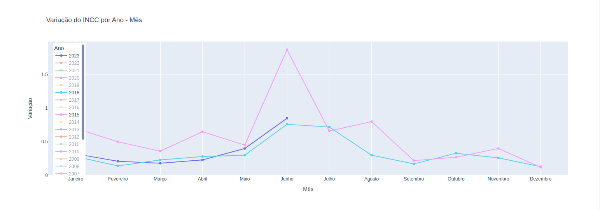

# Índice Nacional de Custo da Construção (INCC-M)

Trata-se de um indicador econômico que capta a evolução de custos de construções residenciais.

Neste snippet, criei um plotly iterativo para que você possa acompanhar a evolução do INCC-M ao longo dos meses e anos.

*Referência para os dados: [Dados de Mercado](https://www.dadosdemercado.com.br/economia/incc-m)*

---

# E.g:

